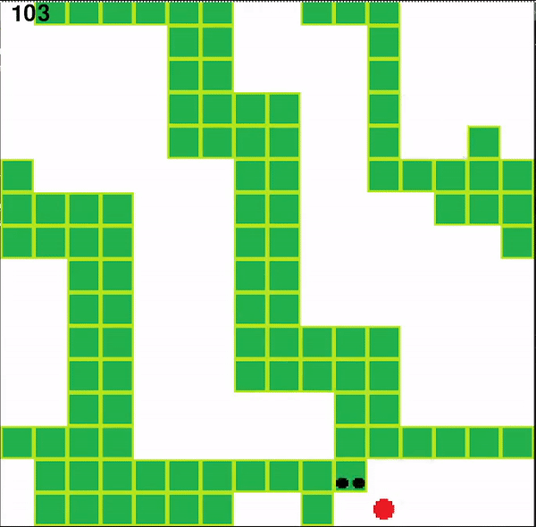

# Snake-AI



# Table of Contents
1. [Introduction](#introduction)
2. [Getting Started](#getting-started)
   - [Prerequisites](#prerequisites)
   - [Installation](#installation)
3. [Main Application](#main-application)
4. [Code Structure](#code-structure)
5. [Algorithm Explanation](#algorithm-explanation)
   - [Background: Q-Learning](#background-q-learning)
   - [Challenges with Classic Q-Learning](#challenges-with-classic-q-learning)
   - [Introduction of Neural Networks](#introduction-of-neural-networks)
   - [DQN in the Snake Game](#dqn-in-the-snake-game)
   - [Benefits of DQN](#benefits-of-dqn)
   - [Limitations](#limitations)
6. [Authors](#authors)
7. [License](#license)

## Introduction

This project utilizes the power of deep learning to train an intelligent agent to play the classic Snake game. Using Python and advanced algorithms, the agent learns and adapts its strategy to optimize game performance. The project employs a deep Q-network (DQN) to empower the agent to make decisions based on environmental cues and past experiences.

## Getting Started

### Prerequisites

- Python 3.10 or higher
- Git

### Installation

Clone and set up the project with the following commands:

```shell
git clone https://github.com/kryczkal/SnakeAI.git
cd SnakeAI
```

It's recommended to create a virtual environment for project dependencies:
```shell
python -m venv `myPythonEnv`
source `myPythonEnv`/bin/activate
```

Install the required Python dependencies:
```shell
pip install -r requirements.txt
```

## Main Application
Start the Snake game with the following command:

```shell
python main.py
```

## Code Structure
The project consists of several key modules:

- `Agent.py`: Defines the AI agent's behavior and decision-making processes.
- `Fruit.py`: Manages the fruit for the Snake, including placement and scoring.
- `Game.py`: Controls the game mechanics, such as the game loop and interactions.
- `Linear_QNET.py` and `Qtrainer.py`: Implement the deep Q-network and its training logic.
- `Snake.py`: Manages the Snake's movement, growth, and collisions.
- `Plotter.py`: Provides utilities for plotting and visualizing the agent's performance.
- `main.py`: The entry point of the program, combining all components to run the game.

## Algorithm Explanation

**Deep Q-Network (DQN)**:

The core algorithm driving the AI agent in this project is the Deep Q-Network (DQN), a breakthrough in reinforcement learning that combines traditional Q-learning with deep neural networks.

### Background: Q-Learning

- **Q-Learning**: At its heart, Q-learning is a model-free reinforcement learning algorithm. It learns the value of taking a certain action in a given state to maximize the expected reward. These values are stored in a table known as the Q-table.
- **Action-Value Function (Q-Function)**: This function estimates the expected rewards for taking an action in a given state and following the optimal policy thereafter. Mathematically, it's denoted as Q(s, a).

### Challenges with Classic Q-Learning

- **Scalability**: For complex environments like the Snake game, the state space can be vast, making it impractical to maintain a Q-table.
- **Generalization**: Q-learning struggles to generalize learning from one state-action pair to another.

### Introduction of Neural Networks

- **Function Approximators**: In DQN, a neural network is used as a function approximator for the Q-function. This network, known as the Q-network, inputs the state of the game and outputs Q-values for each possible action.
- **Experience Replay**: To break the correlation between consecutive learning updates and to use the data more efficiently, DQN employs a technique called experience replay. Past experiences are stored in a replay buffer, and the network is trained on random mini-batches from this buffer.
- **Target Network**: To stabilize learning, DQN uses two networks: a primary network that is updated regularly and a target network that is updated less frequently. This helps in reducing the correlations with the target.

### DQN in the Snake Game

- **State Representation**: The state of the game (position of the snake, fruit, and obstacles) is fed into the network.
- **Reward Function**: Rewards are assigned for actions like moving towards the fruit, eating the fruit, or avoiding a collision.
- **Learning Process**: 
   - The agent takes an action based on the current Q-values, observes a reward and a new state.
   - This transition (old state, action, reward, new state) is stored in the replay buffer.
   - Periodically, the network is trained on a batch of these transitions, adjusting the weights to maximize the expected future rewards.
   - The Q-values are updated, influencing future actions.

### Benefits of DQN

- **Generalization**: The network can generalize from past experiences to unseen states.
- **Efficiency**: By using mini-batches from the replay buffer, learning is more sample-efficient.
- **Stability**: The use of a target network helps in stabilizing the learning process.

The DQN algorithm allows the Snake agent to progressively learn better strategies to play the game, adapting its approach based on the feedback from its environment.

### Limitations

While the Deep Q-Network (DQN) algorithm significantly enhances the agent's performance in the Snake game, there are inherent limitations stemming from the nature of the input provided to the neural network. The network's input primarily focuses on the immediate dangers surrounding the snake, such as nearby walls or its own body. However, this approach has a notable constraint:

- **Limited Long-Term Strategic Planning**: The neural network's limited input scope means the agent lacks the foresight to avoid scenarios where it might become entrapped in an enclosed space, such as creating a loop with its own body from which it cannot escape. 

As a response to this limitation, the agent adapts a particular strategy over several iterations of training. It tends to navigate from one corner of the screen to the opposite corner, leveraging this approach to mitigate the risk of entrapment. However, it's important to acknowledge that:

- **Inherent Imperfection in Strategy**: Despite this adaptive strategy, achieving a perfect solution in the Snake game is unattainable with the current neural network design. The agent's decision-making is constrained to immediate concerns, lacking a comprehensive strategy for the entire game board.

These limitations highlight areas for future improvement.


## Authors
- [Lukasz Kryczka](https://github.com/kryczkal)

## License
Distributed under the MIT License. See `LICENSE.txt` for more information.
